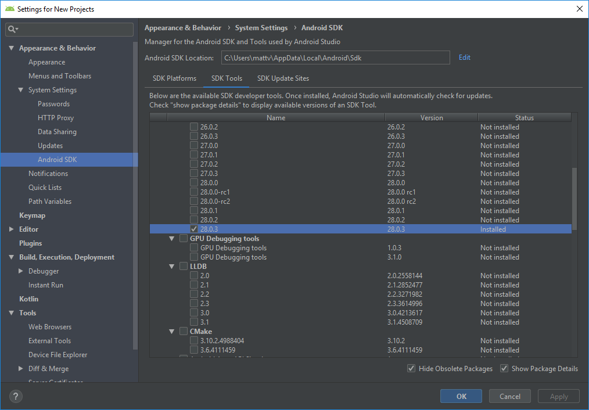

# Setup


- [ ] Prerequisites
  - [ ] Node version 8+
- [ ] [Download](https://developer.android.com/studio/index.html#downloads) and install Android Studio
  - [ ] install Chocolately
    - [ ] install Python2, JDK8
  - [ ] install application
  - [ ] install SDK with options
  - [ ] Verify SDK options
  - [ ] Add Variables
    - [ ] Add `ANDROID_HOME` environment variable
    - [ ] Add `platform-tools` to Path
- [ ] Create Auth0 Account
  - [ ] create tenant
  - [ ] create application

## Auth0

### Sign in or create an account with Auth0.

### Create a new tenant domain for the account. 


### Setup your account type.


### Your Auth0 dashboard allows to manage your tenant.


### New Application

Next, add an application to your tenant. Click the `+ NEW APPLICATION` button. 


Select the React Native SDK


Download the Sample


Run the sample.

1. Set the callback URL

```ts
auth0.samples.Auth0Sample://auth0-experiment.auth0.com/ios/auth0.samples.Auth0Sample/callback,com.auth0sample://auth0-experiment.auth0.com/android/com.auth0sample/callback
```

2. Install packages

```
npm install # Install dependencies
react-native link react-native-auth0 # Link the native module
react-native run-android # Run on Android device
```

## Android 

I chose to use the native setup/configuration for the application. I could have chosen to use [Expo Toolchain](), however, I wanted a plain application without the overhead of using another tool. 

> The Android Studio and configuration items take quite awhile to download. I suggest having something interesting to do while this is going on.

> Note: Run the `Powershell` command as an Administrator.

```ts
Set-ExecutionPolicy Bypass -Scope Process -Force; iex ((New-Object System.Net.WebClient).DownloadString('https://chocolatey.org/install.ps1'))
```

Use Chocolately to install `python` and `jdk8`. 

```ts
choco install -y nodejs.install python2 jdk8
```

> Make note of the JDK installation directory, you will need it to create the `JAVA_HOME` environment variable. Although, installed by Chocolately, the Android JDK configuration uses an internal JRE: `C:\Program Files\Android\Android Studio\jre`

```ts
choco
Chocolatey v0.10.11
Please run 'choco -?' or 'choco <command> -?' for help menu.
PS D:\development\buildmotion\auth0-react-native-firebase-cloud-messaging> choco install -y nodejs.install python2 jdk8
Chocolatey v0.10.11
Installing the following packages:
nodejs.install;python2;jdk8
By installing you accept licenses for the packages.
Progress: Downloading nodejs.install 11.10.0... 100%

nodejs.install v11.10.0 [Approved]
nodejs.install package files install completed. Performing other installation steps.
Installing 64 bit version
Installing nodejs.install...
nodejs.install has been installed.
  nodejs.install may be able to be automatically uninstalled.
Environment Vars (like PATH) have changed. Close/reopen your shell to
 see the changes (or in powershell/cmd.exe just type `refreshenv`).
 The install of nodejs.install was successful.
  Software installed as 'msi', install location is likely default.
Progress: Downloading python2 2.7.15... 100%

python2 v2.7.15 [Approved]
python2 package files install completed. Performing other installation steps.
Downloading python2 64 bit
  from 'https://www.python.org/ftp/python/2.7.15/python-2.7.15.amd64.msi'
Progress: 100% - Completed download of C:\Users\mattv\AppData\Local\Temp\chocolatey\python2\2.7.15\python-2.7.15.amd64.msi (19.31 MB).
Download of python-2.7.15.amd64.msi (19.31 MB) completed.
Hashes match.
Installing python2...
ERROR: Running ["C:\WINDOWS\System32\msiexec.exe" /i "C:\Users\mattv\AppData\Local\Temp\chocolatey\python2\2.7.15\python-2.7.15.amd64.msi" /qn /norestart ALLUSERS=1 ADDLOCAL=ALL TargetDir="C:\Python27" ] was not successful. Exit code was '3010'. See log for possible error messages.
  python2 may be able to be automatically uninstalled.
Environment Vars (like PATH) have changed. Close/reopen your shell to
 see the changes (or in powershell/cmd.exe just type `refreshenv`).
 The install of python2 was successful.
  Software installed as 'msi', install location is likely default.
Progress: Downloading jdk8 8.0.201... 100%

jdk8 v8.0.201 [Approved]
jdk8 package files install completed. Performing other installation steps.
Downloading JDK from http://download.oracle.com/otn-pub/java/jdk/8u201-b09/42970487e3af4f5aa5bca3f542482c60/jdk-8u201-windows-x64.exe
Installing jdk8...
jdk8 has been installed.
PATH environment variable does not have C:\Program Files\Java\jdk1.8.0_201\bin in it. Adding...
  jdk8 may be able to be automatically uninstalled.
Environment Vars (like PATH) have changed. Close/reopen your shell to
 see the changes (or in powershell/cmd.exe just type `refreshenv`).
 The install of jdk8 was successful.
  Software installed to 'C:\Program Files\Java\jdk1.8.0_201\'

Chocolatey installed 3/3 packages. 
 See the log for details (C:\ProgramData\chocolatey\logs\chocolatey.log).

Packages requiring reboot:
 - python2 (exit code 3010)

The recent package changes indicate a reboot is necessary.
 Please reboot at your earliest convenience.
 ```

 Install the React Native CLI

 ```ts
 npm install -g react-native-cli
 ```
output
 ```ts
 npm install -g react-native-cli
C:\Users\mattv\AppData\Roaming\npm\react-native -> C:\Users\mattv\AppData\Roaming\npm\node_modules\react-native-cli\index.js
+ react-native-cli@2.0.1
added 41 packages from 15 contributors in 3.581s
```

Install Android Studio

When complete, you will get the Android Studio splash screen. Use the `Configure` dropdown to view options for the develop environment.


## Configure the SDK Packages

Verify the SDK configuration by selecting `Configure | SDK Manager`. This will display


Make the [Show Package Details] option is checked to view the details of the specified package. Make sure the following items are checked.

* Android SDK Platform 28
* Intel x86 Atom_64 System Image or Google APIs Intel x86 Atom System Image


Next, select the "SDK Tools" tab and check the box next to "Show Package Details" here as well. Look for and expand the "Android SDK Build-Tools" entry, then make sure that 28.0.3 is selected.



### Add System/Environment Variables
Follow the instructions in the [Getting Started](https://facebook.github.io/react-native/docs/getting-started) page to:

* Add Environment Variable `ANDROID_HOME` (Windows configuration). Use the `Sdk` folder path as the value for the environment variable.
* Add `platform-tools` to Path
* Add `JAVA_HOME` TO environment variables.


You will need to use the path to the `JRE` that the Android configuration is using. Update `JAVA_HOME` path to use the following. 

```ts
C:\Program Files\Android\Android Studio\jre
```


```ts
ERROR: JAVA_HOME is not set and no 'java' command could be found in your PATH.

Please set the JAVA_HOME variable in your environment to match the
location of your Java installation.
```

## Run the Application

Before you run the application, the build process includes the path information - 

* License exception error
  * You need to install and accept the license of the specified SDK that the application is using
  * Check the `build.gradle` file to determine the targe SDK (It should be noted in the error message.)


* Execution failed for task ':app:mergeDebugResources'
  * The file paths of the resources are too long. Change the path of the build output to a shorter directory path
  * Example: `D:\tmp\`
  * Add the configuration to the `build.gradle` file.

  ```ts
  allprojects {
      buildDir = "D:/tmp/${rootProject.name}/${project.name}"
  }
  ```

```ts
react-native run-android
```

## Trouble-shooting

* https://stackoverflow.com/questions/48298910/react-native-java-home-is-not-set-and-no-java-command-could-be-found-in-your/48299843#48299843

## Deployment

Code Push
AppHub Deploy
fastlane
Hocky App
