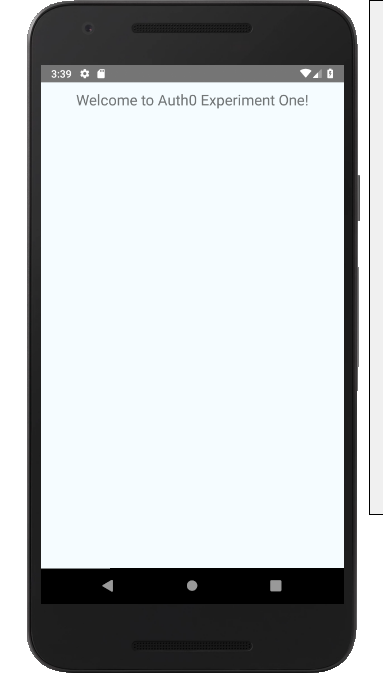
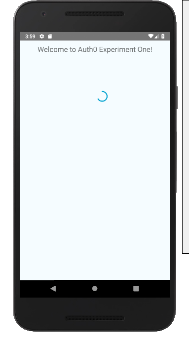

# Execution of Experiment

## Prerequisites

- [ ] Environment Setup
  - [ ] Tool Installation
    - [ ] Node (version 8 or greater)
    - [ ] Android Studio
    - [ ] Java (installed with Android Studio)
    - [ ] React Native CLI
  - [ ] Install Android Platforms and Tools
  - [ ] Configure Environment Variables

- [ ] Create New React Native application
  - [ ] Use CLI: `react-native init rnApp`
  - [ ] Determine which AVD to run
  - [ ] Run Android Virtual Device
  - [ ] Verify React Native application runs

- [ ] Create Auth0 Account
  - [ ] Create Application
    - [ ] Need configuration information from application settings
  - [ ] Enable Social connection for Google authentication.

- [ ] Login Screen
  - [ ] create Login screen
  - [ ] setup routes and navigation for application (i.e., Login)
  - [ ] add global and local styles

## Create Application Screens

The application will require a _login_ screen to allow for the authentication with Auth0. Additionally, 
we will require navigation functionality as well. Create the `Login` screen in a new folder `app/screens`.

* import items from `react` and `react-native`
* import the local and global styles
* `export` a class that extends `Component`
* implement the `render()` to provide the view with styles.
 
_src\auth0ExperimentOne\app\screens\login\LoginScreen.js_
```js
import React, { Component } from "react";
import { View, Text, Button, ActivityIndicator } from "react-native";
import { NavigationActions, StackActions } from "react-navigation";
import Auth0 from "react-native-auth0";

import {
  headerColorStyle,
  headerTextColorStyle,
  buttonStyle
} from "../../theme/Colors";
import styles from "./Login.styles";

const auth0Config = {
  domain: 'auth0-experiment.auth0.com',
  clientId: '985377187090-eov88ja9u3uf0r96i23jclg2r67l859l.apps.googleusercontent.com'
}

const auth0 = new Auth0({
  domain: auth0Config.domain,
  clientId: auth0Config.clientId
});

/**
 * Use to provide login/authentication using the Auth0 API.
 */
export default class LoginScreen extends Component {

  static navigationOptions = ({ navigation }) => {
    return {
      headerTitle: "Login",
      headerStyle: {
        backgroundColor: headerColorStyle
      },
      headerTitleStyle: {
        color: headerTextColorStyle
      }
    };
  };

  /**
   * Use to determine if the screen has initialized.
   */
  state = {
    hasInitialized: false
  };

  /**
   * Use to perform an early check to determine if the user's access token exists.
   */
  componentDidMount() {
    console.log(`Determine if an access token exists for the user.`);

    /**
     * Attempt to retrieve token for storage:
     * 1. if token exists, 
     *    a. use token and Auth0 to authenticate user
     *    b. if authenticated, route user to the [default app screen] with [data].
     *    c. if error during authentication (e.g., expired token), refresh token and restart
     * 2. if token does NOT exist
     *    a. initialization is [true/complete]
     *    b. user must [Login] via button.
     */

    this.setState({
      hasInitialized: true
    });
  }

  render() {
    return (
      <View style={styles.container}>
        <ActivityIndicator
          size="large"
          color="#05a5d1"
          animating={!this.state.hasInitialized}
        />
        {this.state.hasInitialized && (
          <Button onPress={this.authorize} title="Login" color={buttonStyle} />
        )}
      </View>
    );
  }

  authorize() {
    console.log('Use Auth0 API to authorize user...');
    auth0.webAuth
      .authorize({
        scope: auth0Config.scope,
        audience: auth0Config.audience,
        // device: DeviceInfo.getUniqueID(),
        prompt: "login"
      })
      .then(authResponse => {
        auth0.auth
          .userInfo({ token: authResponse.accessToken })
          .then(data => {
            this.routeToHome(data);
          })
          .catch(error => {
            console.log("Error: ");
            console.log(JSON.stringify(error));
          });

        // persist the [accessToken] and the [refreshToken] 
      })
      .catch(error => {
        console.log(error);
      });
  }

  routeToHome = userInformation => {
    this.setState({
      hasInitialized: true
    });

    const resetAction = StackActions.reset({
      index: 0,
      actions: [
        NavigationActions.navigate({
          routeName: "Home",
          params: {
            name: userInformation.name,
            picture: userInformation.picture
          }
        })
      ]
    });

    this.props.navigation.dispatch(resetAction);
  };
}
```

Styles for the Login screen are seperated into a `.styles.js` file for the specified screen.

> Note: Keeping the relative files together by convention. Each screen items will have all of its members in a distinct screen folder. 

_src\auth0ExperimentOne\app\screens\login\Login.styles.js_
```js
import { StyleSheet } from "react-native";

const styles = StyleSheet.create({
	container: {
		flex: 1,
		justifyContent: "center",
		alignItems: "center"
	}
});

export default styles;
```

The application will also have some global styles.

_src\auth0ExperimentOne\app\theme\Colors.js_
```js
const headerColorStyle = "#333";
const headerTextColorStyle = "#FFF";
const buttonStyle = "#555";

export { headerColorStyle, headerTextColorStyle, buttonStyle };
```

## Navigation

To provide navigation, install the navigation package listed below. 

```ts
npm install -S native-react-navigation
```

The routes will be setup in the `Root.js` file. The `StackNavigator` will provide the stack-based navigation for the application. 

* import the LoginScreen
* create the `Stack` object with routes.
* export the `Stack` to allow access to the routes.

```js
import React from "react";
import { StackNavigator } from "react-navigation";

import LoginScreen from "./app/screens/login/LoginScreen";

const Stack = StackNavigator(
  {
    Login: {
      screen: LoginScreen
    }
  },
  {
    initialRouteName: "Login"
  }
);

export default Stack;
```

We should be able to refresh the application and view the resuls in the Android emulator. 




### Authentication State

The application is not currently doing anything. This is because there is not _state_ being tracked for the current user. When the application initializes, we will want to determine: 

* is the user authenticated
  * no: route the user to the `LoginScreen` 
  * yes: route the user to the default application page.

Therefore, the application requires some state management.

>Pro Tip: Use the [Lifecycle hooks of a React Native Component](https://www.geeksforgeeks.org/reactjs-lifecycle-components/) to implement discreet bits of functionality in a screen [Component](https://blog.usejournal.com/understanding-react-native-component-lifecycle-api-d78e06870c6d).


asdfasdf



Import `ActivityIndicator` 

```js
import { View, Text, ActivityIndicator } from "react-native";
```

asdf

* added an `ActivityIndicator` to the screen if the application is not initialized
* 

```js
  state = {
    hasInitialized: false
  };

  render() {
    return (
      <View
        style={{
          flexDirection: 'row',
          height: 100,
          padding: 20,
        }}>
        <ActivityIndicator
          size="large"
          color="#05a5d1"
          animating={!this.state.hasInitialized}
        />
        {this.state.hasInitialized && (
          <Button onPress={this.login} title="Login" color={buttonStyle} />
        )}
      </View>
    );
  }

  login() {
    console.log('Use Auth0 API to authorize user...')
  }
```

## Auth0 Account

Created a new Auth0 account and followed the prompts to create my React Native application. The Auth0 website provides a sample application that you can download as well. 

Retrieved Callback URL from the Download Sample application window. The URL is specific to the my target application called **auth0-experiment**.

```ts
auth0.samples.Auth0Sample://auth0-experiment.auth0.com/ios/auth0.samples.Auth0Sample/callback, com.auth0sample://auth0-experiment.auth0.com/android/com.auth0sample/callback
```


## Setup Authentication Using Social Media

### Google

* Get Client ID and Secret (not required) - you can use the Auth0 dev keys. 
* Configure which application that you want to allow Google authentication.


## React Native

Install packages for the application.

```ts
npm install -S react-native-auth0@1.2.2
```

You will need to link the native modules to the application.

```ts
react-native link react-native-auth0
```

You should see successful linked messages for each of the `link` commands. 

```ts
react-native link react-native-auth0
rnpm-install info Linking react-native-auth0 ios dependency
rnpm-install info Platform 'ios' module react-native-auth0 has been successfully linked
rnpm-install info Linking react-native-auth0 android dependency
rnpm-install info Platform 'android' module react-native-auth0 has been successfully linked
```

Use the following to unlink a native library from the application.

```ts
react-native unlink react-native-auth0
```

### Setup Auth0 Configuration

Create an environment file to contain the Auth0 configuration information.

>Note: You should ignore this file for your code repository.

_.env example:_
```ts
AUTH0_DOMAIN="YOUR_AUTH0_DOMAIN"
AUTH0_CLIENT_ID="YOUR_AUTH0_APP_CLIENT_ID"
AUTHO_SCOPE="openid offline_access profile email"
AUTH0_AUDIENCE="https://YOUR_AUTH0_DOMAIN/userinfo"
```

## Allow Application to Open a Browser Window

Add the following attribute to the `AndroidManifest.xml` `activity` section.

```ts
android:launchMode="singleTask"
```

_sample\rnApp\android\app\src\main\AndroidManifest.xml_
```xml
<manifest xmlns:android="http://schemas.android.com/apk/res/android"
  package="com.rnapp">

    <uses-permission android:name="android.permission.INTERNET" />
    <uses-permission android:name="android.permission.SYSTEM_ALERT_WINDOW"/>

    <application
      android:name=".MainApplication"
      android:label="@string/app_name"
      android:icon="@mipmap/ic_launcher"
      android:roundIcon="@mipmap/ic_launcher_round"
      android:allowBackup="false"
      android:theme="@style/AppTheme">
      <activity
        android:name=".MainActivity"
        android:label="@string/app_name"
        android:configChanges="keyboard|keyboardHidden|orientation|screenSize"
        android:windowSoftInputMode="adjustResize"
        android:launchMode="singleTask">
        <intent-filter>
            <action android:name="android.intent.action.MAIN" />
            <category android:name="android.intent.category.LAUNCHER" />
        </intent-filter>
      </activity>
      <activity android:name="com.facebook.react.devsupport.DevSettingsActivity" />
    </application>

</manifest>
```