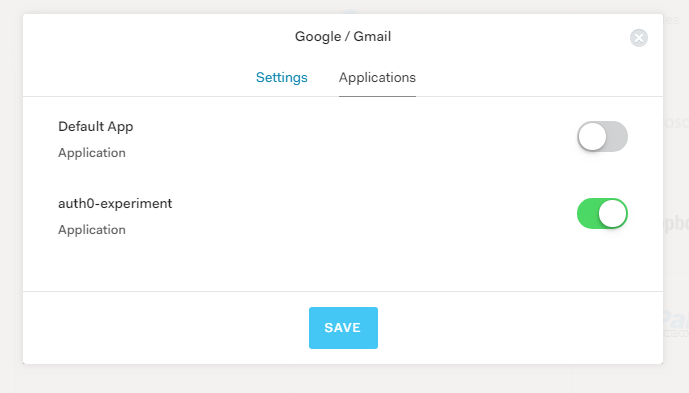

# Execution of Experiment

# Auth0 Account

Created a new Auth0 account and followed the prompts to create my React Native application. The Auth0 website provides a sample application that you can download as well. 

Retrieved Callback URL from the Download Sample application window. The URL is specific to the my target application called **auth0-experiment**.

```ts
auth0.samples.Auth0Sample://auth0-experiment.auth0.com/ios/auth0.samples.Auth0Sample/callback, com.auth0sample://auth0-experiment.auth0.com/android/com.auth0sample/callback
```


## Setup Authentication Using Social Media

### Google

* Get Client ID and Secret (not required) - you can use the Auth0 dev keys. 
* Configure which application that you want to allow Google authentication.



## React Native

Install packages for the application.

```ts
npm install -S react-native-auth0@1.2.2
npm install -S react-navigation@2.2.3
npm install -S react-native-device-info@0.21.0
npm install -S react-native-sensitive-info@5.1.0
npm install -S react-native-config@0.11.5
npm install -S react-native-restart@0.0.6
```

You will need to link the native module `react-native-auth0` to the application.

```ts
react-native link react-native-auth0
```

asdf

```ts
react-native link react-native-auth0
rnpm-install info Linking react-native-auth0 ios dependency
rnpm-install info Platform 'ios' module react-native-auth0 has been successfully linked
rnpm-install info Linking react-native-auth0 android dependency
rnpm-install info Platform 'android' module react-native-auth0 has been successfully linked
```

### Setup Auth0 Configuration

Create an environment file to contain the Auth0 configuration information.

>Note: You should ignore this file for your code repository.

_.env example:_
```ts
AUTH0_DOMAIN="YOUR_AUTH0_DOMAIN"
AUTH0_CLIENT_ID="YOUR_AUTH0_APP_CLIENT_ID"
AUTHO_SCOPE="openid offline_access profile email"
AUTH0_AUDIENCE="https://YOUR_AUTH0_DOMAIN/userinfo"
```

```ts
AUTH0_DOMAIN="auth0-experiment.auth0.com"
AUTH0_CLIENT_ID="mN2foeZqhm27kVgpoeq751T2q71ASDp5"
AUTHO_SCOPE="openid offline_access profile email"
AUTH0_AUDIENCE="https:/auth0-experiment.auth0.com/userinfo"
```

